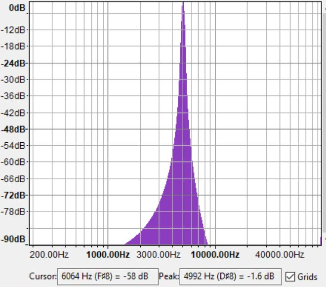
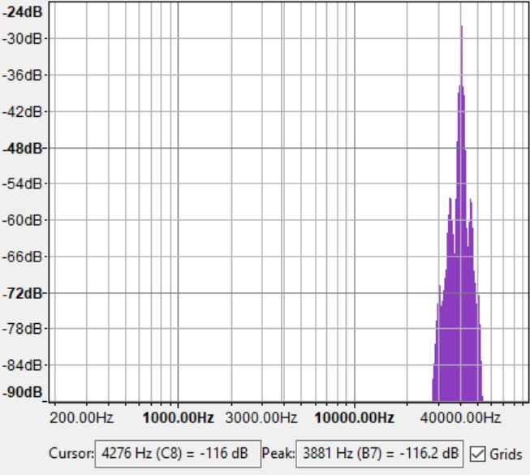

# Dolphin Attack on Smart Home Systems
# About 

This is the [project website](https://ucla-ece209as-2018w.github.io/Aadithya-Nrithya/) for the course ECE 209 AS. This website contains the necessary material for the project ' Dolphin Attack on Smart Home Systems'. It includes
- Problem statement
- Related Work
- Approach
- Method
- Findings
- Analysis
- Discussion

# Problem Statement
<p align="justify">
There is an increasing usage of Speech Recognition systems developed by Google, Amazon, Apple and Microsoft in Mobile Phones, Laptops and more recently smart home speaker systems. With fast advances in Machine Learning, Artificial Intelligence and Embedded Systems, these speech recognition systems are making their way into the common man's home, performing everyday tasks [1]. However there always vulnerabilities in any technology. One such vulnerability that can be exploited to a attacker's advantage is the non-linearity of the microphones present in the COTS devices. Inaudible sounds (Ultrasonic frequency) can used to attack these devices by exploiting the above vulnerability. Ultrasonic sounds which are above 20 KHz and completely inaudible, can still be picked up the speech recognition systems in these devices through the non-linearity of the audio circuits. The original low frequency components used to modulate the ultrasound carrier are demodulated and interpreted by the SR systems due to this effect. The attack we choose to implement is the portable Dolphin Attack which involves attacking mobile phones and laptops by transmitting attack commands from a smart phone over a ultrasonic transducer. This attack is relatively inexpensive and can be launched on the fly. The amount of damage that can be caused to the user can be both mental and monetary. Dolphin commands can be used to accomplish benign tasks like prank calls,order takeouts, schedule Uber and range upto malicious monetary transcations. We analyse the feasibility of carrying out the portable Dolphin attack and evaluate the results. 
</p>

# Related Work

<p align="justify">
Traditionally, several techniques have been used to attack Speech Recognition and Voice Control Systems. An interesting attack on the early generation Alexa in Amazon Echo was entirely unintentional [2] NPR's weekend edition broadcast a listen up section about Alexa which prompted a number of these devices to respond to the story by turning up the thermostat and shopping online. Carlini et al., chose to attack the speech recognition system by hiding the attack commands such that they can be deciphered by the system but remain incomprehensible to the user [3]. This attack is accomplished in both scenarios, when the attackers have knowledge of the SR system's internal structure and when they do not. This work is based on the work of Vaidya et al in mangling normal input commands using an audio mangler which converts them into morphed sounds which retain the acoustic features of the key words [4]. In CommanderSong, attack commands are embedded in songs which are then used to attack the voice control systems. The wireless cahnnel may also be utilized for command injection [5]. Chaouki et al show that specific electromagnetic commands can be coupled with the headphones used with smartphones in order to inject voice commands to the speech recognition systems. The attack closest to the Dolphin attack is the Backdoor Attack [6]. Here, two ultrasonic signals, one carrying the attack command and another pilot tone used for original signal reconstruction are transmitted to the receiver. The microphone non linearities are ultilized to recover the original attack command and activate the speech recognition system. The Dolphin attack is superior to the above approaches in that it can be accomplished without being noticed by the user, without any commodity hardware and is relatively inexpensive.
</p>

# Approach

The DolphinAttack can be accomplished using two methods
  
- Tabletop Attack 
- Portable Attack


## Tabletop Attack

<p align="justify">
This is the original version of the attack, carried out using custom hardware. It consists of :
</p> 

- Audio signal source
- Vector signal generator
- Vifa ultrasonic speaker

<p align="justify">
The attack commands are generated using a text to speech converter on a smart phone. The audio output is given to a vector signal generator which is used to modulate the input frequency on a high frequency carrier. The signal generator can be used to sweep over a range of frquencies to find the most effective attack frequency for a given phone model and SR system. The output of the signal generator is connected to a Vifa Ultrasonic speaker which transmits the modulated commands. The attack success can be tested on different SR systems like Siri, Cortana, Google Assistant Alexa etc on different devices like laptops and mobilephones.
</p>


## Portable Attack

<p align="justify">
This is the "on the go" version of the attack, used to test the feasibility of attacking the victim while on the move, walking past him/her, for example. It consists of :
</p>

- Audio signal source
- Audio Amplifier
- Ultrasonic transducer

<p align="justify">
The attack commands are generated by recording the attackers voice on a smart phone. It is then modulated on software or the output of signal generator from the tabletop attack is stored in the smartphone. This modulated audio signal is given as the input to a audio amplifier through the phone's audio jack. The amplifier output is used to drive the ultrasonic transducer. The range of this attack is slightly limited compared to the tabletop attack but can be increased by increasing the amplifier gain.
</p>

The portable dolphin attack was chosen as the means of attack over the table top attack for two major reasons :

- Low Cost of Implementation
- Reduced physical Intervention

<p align="justify">
According to the analysis in [1], the cost of implementing the attack through the portable mode was only a few dollars as opposed to the default table top which involved using the expensive Ultrasonic wideband speaker Vifa and the Vector Signal Generator.

At the receiver side, the non linearity present in the device's microphone can be modeled as
</p>
   out(t ) = A*sin(t) + B*(sin<sup>2</sup>(t))
   
In order to utilize this non linearity to demodulate the the baseband signal, the original voice signal is amplitude modulated using the following function
(add equation)
From the two equations, the signal at the receiver end contains the the intended carrier and it's sideband frequencies and also harmonics and cross products at f<sub>m</sub>, 2(f<sub>c</sub>−f<sub>m</sub>), 2(f<sub>c</sub>+f<sub>m</sub>), 2f<sub>c</sub> , 2f<sub>c</sub>+f<sub>m</sub>, and 2f<sub>c</sub>−f<sub>m</sub>. The microphone is followed by an amplifier and a low pass filter which removes all components above the audible range. However, the original signal,fm, remains within the audible range and can be successfully recognised by the speech recognition system to perform the attack.
</p>

# Method
<p align="justify">
The components that are required for carrying out the portable attack include :

- 3.5 mm Audio Jack pigtail-mono and stereo
- SparkFun Class-D audio amplifier TPA2005D1
- Samsung S7 Edge  as Attack phone
- Multiple Smartphones as Victim
- Ultrasonic transducer (UTR-1440K-TT-R)
- Battery

The Software includes 

- Matlab
- Audacity
- Mbed Online Compiler


### Samsung S7 Edge

The attack requires carrier frequency - baseband frequency to be greater than 20khz. The minimum sampling rate should be twice this value. Most smart phones only support a maximum sampling rate of upto 48khz, restricting the transmitted signal to a frequency of 24khz
This does not give us a wide range of frequencies to work with. Fortunately, the Samsung Galaxy S7 Edge supports a sampling rate of 192khz and lends itself well to construct the attack.

### Audio Amplifier

The TPA2005D1 is chosen as it is a variable gain audio amplifier meant specifically to drive transducers. The default gain value is 2 but can be increased upto 10, thereby extending therange of the portable attack

### Ultrasonic transducer (UTR-1440K-TT-R)

The Samsung phone provides a sufficient sampling rate, however it’s speaker's output frequencies are restricted to the audio range.
Thus a narrow band transducer is utilized for transmission of the attack signal over the ultrasonic band of 40kHz. This particular carrier is chosen as it was the most widely available as opposed to other frequency ranges like 23 or 25khz.

### Victim devices

The attack was tested on various victim phones like
- Oneplus 5
- Xiomi Redmi Note 4
- Samsung S6 Edge
- Samsung S7 Edge

Tablet
- Nexus 5
- Apple Watch

## Initial Attack

Input voice signals were recorded on the Samsung S7 and modulated on a 40khz carrier using MATLAB. The output wave file was given as input to the audio amplifier through a 3.5mm stereo audio jack, as the phone had a stereo speaker. However, the amplifier operates on a differential input. So the left and right channels of the audio jack are combined together before connecting to the amplifier. This is powered by a 4.7V battery. The output of the audio amplifier is given as input to the ultrasonic transducer. The attack is tested on the above mentioned victim devices at varying distances and for various input commands like "whats the temperature' , 'ok google" etc.

 
<figure>
      
        <figcaption>Matlab Transmitter Side Analysis</figcaption>
</figure>

## Findings

We found that the original signal was not reconstructed at the receiver end as expected. Further analysis of individual components was thus required. The audio jack output was connected to an oscilloscope. On sweeping the frequencies given as input to the jack from the phone, over a range of 20-20khz, it was found that the sound was cut off at 14khz. In order to test if this filtering was done by the phone or the audio jack, the same test was repeated using different phones to find the same effect at the same frequency. Also, it was found that the phone could play 18khz and possibly belong by manual testing using commodity earphones. The stereo jack was replaced by a 3.5mm mono jack and the experiment was repeated. This jack was found to cut off frequencies below 16khz. 
Additionally, the non linearity model for the microphone at the receiver seemed to hold for the speaker on the attack side as well. This hypothesis was tested by connecting a probe from the laptop to the oscilloscope and playing the high frequency signal. Components within the audible range were observed. This caused frequency components in the audible range that hindered the proper recognition of commands, at the receiver end.

## **Revised Attack**

The two sources of problem(change this word) were eliminated using an STM32 Nucleo Development board with an Mbed OS as the source of the attack signal. The Nucleo is equipped with a 12 bit DAC, the output of which is connected to the audio amplifier and then to the transducer. The setup's viability is first tested using montone signals. Audacity was used as the tool to generate monotone sine waves. The audio signal, sampled at 96khz was modulated on MATLAB. The resulting wav file was converted to array of samples stored in a C file using a tool called WAVtoCode Converter. The Mbed online compiler was used for generating the binary. The generated binary was flashed in the flash memory of the Nucleo board. 

## **Findings**

The waveform of the signals at the transmitting and receiving end were generated and analysed using matlab and audacity respectively. In The case of the low frequency monotones, the spectrum of the modulated signals was observed at the carrier frequency and it's two sidebands at the transmitter side. However, the expected harmonic on the receiver side could not be distinguished by plotting the spectrum of the signal recorded on the victim microphone. This was because of ambient noise in the range of a few herts to almost 10khz.
When the frequency of the baseband signal is increased beyond the audible range, definite harmonics are observed on the receiver side
This is tested for different frequencies, receivers and at different locations and found consistent. However, the harmonics are not at the expected frequencies. Also, at 96khz, the reconstruction of the DAC output was not satisfactory, so that sampling rate was increased to 192khz
<figure>
      
        <figcaption>Matlab Transmitter Side Analysis for voice </figcaption>
</figure> 

<p float="left">
  
  
</p>


### Markdown

Markdown is a lightweight and easy-to-use syntax for styling your writing. It includes conventions for

```markdown
Syntax highlighted code block

# Header 1
## Header 2
### Header 3

- Bulleted
- List

1. Numbered
2. List

**Bold** and _Italic_ and `Code` text

[Link](url) and 
```

For more details see [GitHub Flavored Markdown](https://guides.github.com/features/mastering-markdown/).

### Jekyll Themes

Your Pages site will use the layout and styles from the Jekyll theme you have selected in your [repository settings](https://github.com/UCLA-ECE209AS-2018W/Aadithya-Nrithya/settings). The name of this theme is saved in the Jekyll `_config.yml` configuration file.

### Support or Contact

Having trouble with Pages? Check out our [documentation](https://help.github.com/categories/github-pages-basics/) or [contact support](https://github.com/contact) and we’ll help you sort it out.


# Reference
[1] https://www.inc.com/kevin-j-ryan/internet-trends-7-most-accurate-word-recognition-platforms.html

[2] 

[3] Carlini, Nicholas, et al. "Hidden Voice Commands." USENIX Security Symposium. 2016.

[4] Vaidya, Tavish, et al. "Cocaine noodles: exploiting the gap between human and machine speech recognition." WOOT 15 (2015): 10-11.

[5] Yuan, Xuejing, et al. "CommanderSong: A Systematic Approach for Practical Adversarial Voice Recognition." arXiv preprint arXiv:1801.08535 (2018).

[6] Zhang, Guoming, et al. "Dolphin Attack: Inaudible voice commands." Proceedings of the 2017 ACM SIGSAC Conference on Computer and Communications Security. ACM, 2017.

[7] Roy, Nirupam, Haitham Hassanieh, and Romit Roy Choudhury. "BackDoor: Sounds that a microphone can record, but that humans can't hear." GetMobile: Mobile Computing and Communications 21.4 (2018): 25-29.


